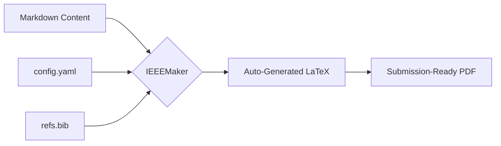

# ieeemaker
- **Visibility**: Private
- **Repository URL**: https://github.com/seeramsujay/ieeemaker
- **Status**: `In Development (No release)`
- **Latest Release Tag**: `None`

## 🚦 Releases & Release Notes
*No releases published yet.*

---

## 📖 README Content

<div align="center">


# 📘 IEEEMaker
### **Transforming Research into Submission-Ready IEEE Manuscripts**

[](https://www.gnu.org/licenses/gpl-3.0)
[](https://www.python.org/downloads/)
[](https://pandoc.org/)
[](https://www.latex-project.org/)

**Stop fighting with LaTeX formatting.** Focus on your research, write in Markdown, and let IEEEMaker handle the heavy lifting of IEEE standards, author blocks, and figure management.

[Explore Roadmap](Archives/ROADMAP.md) • [View Formatting Guide](structure.md) • [Report Bug](https://github.com/seeramsujay/ieeemaker/issues)

</div>

---

## 🚀 Why IEEEMaker?

Writing a paper for IEEE usually means wrestling with complex LaTeX templates or clunky Word files. **IEEEMaker** provides a modern, developer-friendly bridge:

- ✍️ **Write in Markdown**: Use the world's most readable format.
- 🏗️ **Auto-Scaffolding**: One command sets up your entire project.
- 👥 **Smart Author Blocks**: Automatically groups and formats affiliations.
- 📊 **Seamless Graphics**: Support for standard images and automatic `.drawio` conversion.
- 📚 **Reference Management**: Integrated BibTeX support via Pandoc.

---

## 🛠️ Visual Workflow



---

## 🚦 Getting Started

### 1. Prerequisites
Ensure you have the core tools installed:
- [Pandoc](https://pandoc.org/installing.html) (Document conversion)
- [LaTeXmk](https://mg.readthedocs.io/latexmk.html) (PDF compilation)
- [Draw.io CLI](https://www.draw.io/) (Optional, for diagram support)

### 2. Installation
```bash
git clone https://github.com/seeramsujay/ieeemaker
cd ieeemaker
pip install .
```

### 3. Let's Build a Paper!
```bash
# Initialize a new project
ieeemaker init "my_smart_grid_paper"
cd my_smart_grid_paper

# Build the PDF
ieeemaker build
```

---

## 📜 Commands Reference

| Command | Description |
| :--- | :--- |
| `ieeemaker init <name>` | Scaffold a new IEEE project directory |
| `ieeemaker build` | Compile Markdown to PDF |
| `ieeemaker build --watch` | Rebuild automatically on file changes |
| `ieeemaker clean` | Wipe intermediate LaTeX artefacts |
| `ieeemaker export` | Generate a ZIP archive for Overleaf upload |
| `ieeemaker doctor` | Verify your system dependencies |

---

## 📂 Project Organization

A standard project generated by `ieeemaker` follows this structure:

- `paper.md`: Your main research text.
- `config.yaml`: Metadata (Title, Authors, Keywords).
- `refs.bib`: Your bibliography.
- `figures/`: Asset folder for all your images.

> [!TIP]
> Need more details on how to write your Markdown? Check out our **[structure.md](structure.md)** guide.

---

## 🤝 Contributing & Support

Contributions are what make the open-source community such an amazing place to learn, inspire, and create. Any contributions you make are **greatly appreciated**.

1. Fork the Project
2. Create your Feature Branch
3. Commit your Changes
4. Push to the Branch
5. Open a Pull Request

---

## 📜 License
Distributed under the **GPL-3.0 License**. See `LICENSE` for more information.

<div align="center">
  <sub>Built with ❤️ by Sujay Seeram and the IEEEMaker community.</sub>
</div>
