# informedpoll
- **Visibility**: Private
- **Repository URL**: https://github.com/seeramsujay/informedpoll
- **Status**: `In Development (No release)`
- **Latest Release Tag**: `None`

## 🚦 Releases & Release Notes
*No releases published yet.*

---

## 📖 README Content

# 🗳️ Informed Poll

> **Empowering the next generation of voters with AI-driven civic clarity.**

[](https://github.com/seeramsujay/informed-poll)
[](https://cloud.google.com/vertex-ai)
[](https://lancedb.com/)
[](LICENSE)

**Informed Poll** is a high-fidelity, mobile-first election companion designed for first-time voters. It combines the intuitive "swipe" mechanics of modern social apps with a sophisticated **RAG (Retrieval-Augmented Generation)** engine to demystify complex political landscapes.

---

## 🚀 Deployment Status
- **Production URL**: [informed-poll.run.app](https://informed-poll-frontend-51884867643.us-central1.run.app)
- **API Documentation**: [informed-poll-api.run.app/docs](https://informed-poll-backend-51884867643.us-central1.run.app/docs)
- **Region**: `us-central1`
- **Engine**: Google Cloud Run (Fully Managed)

---

## 🛤️ Development Status

### Phase 1: Local Experience & Refinement [COMPLETED]
- [x] Verified local full-stack execution (Vite + FastAPI).
- [x] Implement full candidate swipe logic in `CandidateStack`.
- [x] Connect `ChatAssistant` to production AI responses.
- [x] Integrate comprehensive ECI content via `Dossier` page.
- [x] Build `RegistrationStepper` component.

### Phase 2: Google Services Integration [COMPLETED]
- [x] Connect to Firestore for saving "Personal Ballots".
- [x] Integrate Gemini API (Upgraded to Gemini 2.5 Flash) for grounded AI chat.
- [x] Firebase Auth on frontend (Email + Google OAuth).
- [x] Backend token verification with OIDC.
- [x] High-fidelity RAG using LanceDB.

### Phase 3: Deployment & Scale [COMPLETED]
- [x] Containerized multi-service deployment to Google Cloud Run.
  - **Backend**: [informed-poll-backend.run.app](https://informed-poll-backend-51884867643.us-central1.run.app)
  - **Frontend**: [informed-poll-frontend.run.app](https://informed-poll-frontend-51884867643.us-central1.run.app)
- [x] CI/CD pipeline automation via Cloud Build.
- [x] E2E verification (91/91 Vitest tests passed).
- [x] Premium documentation overhaul (Hackernews-standard).

| Phase | Track | Status | Date |
| :--- | :--- | :--- | :--- |
| **Phase 1** | Local Experience | ✅ Completed | 2026-05-01 |
| **Phase 2** | Google RAG Integration | ✅ Completed | 2026-05-02 |
| **Phase 3** | Cloud Run Deployment | ✅ Completed | 2026-05-03 |

---

## ✨ Key Features

### 🃏 Swipeable Candidate Cards
Tactical, gesture-driven interface for exploring candidates. Build your "Personal Ballot" with intuitive left/right swipes.

### 🧠 VoteIQ: Neural Sync RAG
A chatbot that doesn't hallucinate. Grounded in verified **Election Commission of India (ECI)** data using **LanceDB** and **Gemini 2.5 Flash**.

### 🗺️ Civic Dossier
A comprehensive, interactive timeline of the voting journey—from Form 6 registration to the polling booth protocol.

### 🔐 Secure & Non-Partisan
Stateless backend with Firebase Auth (OIDC) and Firestore for encrypted, private ballot storage.

---

## 🏗️ Architecture

```mermaid
graph TD
    A[Vite + React Frontend] -->|Auth| B[Firebase Auth]
    A -->|API Requests| C[FastAPI Backend]
    C -->|Store Ballots| D[Cloud Firestore]
    C -->|Vector Search| E[LanceDB]
    E -->|Context| F[Gemini 2.5 Flash]
    F -->|Verified Answer| C
    C -->|Response| A
```



For a deep dive into the system design, see [Archives/Architecture.md](Archives/Architecture.md).

---

## 🛠️ Tech Stack

- **Frontend**: React 18, Vite, Vanilla CSS (Kinetic Catalyst), Lucide Icons.
- **Backend**: FastAPI, Uvicorn, Python 3.11+.
- **Database**: 
  - **Firestore**: Transactional user data & voting state.
  - **LanceDB**: High-performance vector store for RAG.
- **AI/ML**: Vertex AI (Gemini 2.5 Flash) via `google-generativeai`.
- **Cloud**: Google Cloud Run (Serverless Containerized).

---

## ⚡ Quick Start

### Prerequisites
- Python 3.11+
- Node.js 18+
- Google Cloud Project with Vertex AI enabled

### Local Setup

1. **Clone & Install**
   ```bash
   git clone https://github.com/seeramsujay/informed-poll.git
   cd informed-poll
   pip install -r requirements.txt
   cd frontend && npm install
   ```

2. **Environment Variables**
   Create a `.env` in the root:
   ```env
   GOOGLE_API_KEY=your_gemini_key
   FIREBASE_PROJECT_ID=your_project_id
   ```

3. **Run Development Servers**
   - **Backend**: `python main.py` (Runs on port 8000)
   - **Frontend**: `cd frontend && npm run dev` (Runs on port 5173)

---

## 📚 Documentation
- [Architecture Deep Dive](Archives/Architecture.md)
- [API Reference](Archives/API.md)
- [Future Steps](Archives/Future_Steps.md)
- [Work Roadmap](lancedb/ROADMAP.md)
- [Product Vision](conductor/product.md)

---

## 🤝 Contributing
We welcome contributions! Please see [Archives/CONTRIBUTING.md](Archives/CONTRIBUTING.md) for guidelines.

---

## 📄 License
Distributed under the MIT License. See `LICENSE` for more information.

---

*Built with ❤️ for the Google Hackathon 2024.*


---

## 🛡️ Licensing & Privacy Protection

Because this repository contains personal code, portfolios, or intellectual property, **strict privacy protections are in place**.

### ⚠️ Prohibitions on AI Training & Scraping
This repository is published for direct human viewing only. Automated data scraping, harvesting, and crawling are strictly prohibited under the author's personal copyright terms.

**By accessing this repository or its contents, you agree to the following terms:**
*   **NO AI/LLM Ingestion:** Any ingestion of code, text, layouts, designs, or assets for training, validation, testing, or tuning of machine learning models, neural networks, or artificial intelligence systems (such as Large Language Models) is strictly prohibited.
*   **NO Automated Data Scraping:** Any automated extraction, parsing, harvesting, or scraping of content by bots, crawlers, scripts, or spiders is prohibited.
*   **Personal Use Only:** Human viewing for personal or educational review is permitted. No duplication, modification, adaptation, or commercial distribution of this work is allowed without express written permission.
