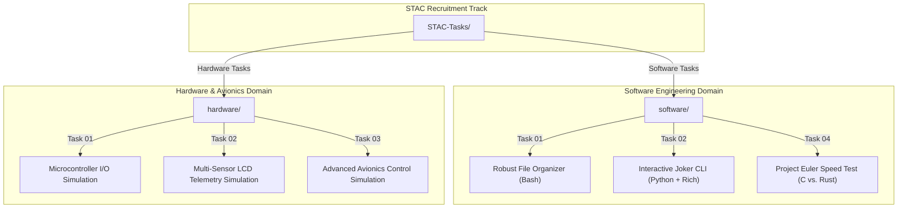

# STAC-Tasks
- **Visibility**: Public
- **Repository URL**: https://github.com/seeramsujay/STAC-Tasks
- **Status**: `In Development (No release)`
- **Latest Release Tag**: `None`

## 🚦 Releases & Release Notes
*No releases published yet.*

---

## 📖 README Content

# 🚀 STAC-Tasks: Space Technology & Aviation Club Recruitment Portfolio

> A high-fidelity compilation of S1 recruitment tasks covering **Defensive Shell Scripting, CLI Request Engines, Systems Programming (C vs. Rust), and Electronic Avionics Simulations** for the Space Technology and Aviation Club (STAC).

[](https://opensource.org/licenses/MIT)
[](https://www.gnu.org/software/bash/)
[](https://www.python.org/)
[](https://llvm.org/)
[](https://www.rust-lang.org/)
[](https://www.arduino.cc/)

Welcome to my **STAC S1 Recruitment Portfolio**. This repository serves as a structured, verified showcase of foundational software engineering, systems programming, and hardware/avionics simulation tasks completed for recruitment into the **Space Technology and Aviation Club (STAC)** at Amrita University.

---

## 🏛️ Portfolio Structure & Domains



---

## 💻 Software Engineering Domain

### 1. Robust File Segregator (`software/Task-01`)
*   **Concept:** A defensive file organization script (`segrV2.sh`) that dynamically parses folders and sorts untidy files into category folders based on their extensions.
*   **Key Logic:**
    *   **Imgs/**: `jpg | jpeg | png | heic | webp`
    *   **Docs/**: `pdf | docx | txt | md`
    *   **Music/**: `mp3 | wav | opus | m4a`
    *   **Misc/**: Fallback for all other file types.
*   **Defensive Features:** Utilizes `mkdir -p` to prevent directory re-creation errors, explicitly ignores the script file (`segrV2.sh`) to prevent self-deletion, and handles path variables cleanly to evade whitespace breakdowns.

### 2. Joker Command Line Interface (`software/Task-02`)
*   **Concept:** An interactive console terminal script (`joker.py`) that queries remote APIs to fetch, format, and display jokes.
*   **Key Technologies:**
    *   **HTTP Engine:** Uses `requests` to fetch jokes from `v2.jokeapi.dev` with strict query params blacklisting inappropriate/NSFW content.
    *   **Console UI:** Employs the `rich` CLI library to print formatted tables and styled output.
*   **Self-Healing Logic:** Implements robust exception blocks (`requests.RequestException`) to catch offline network issues and handles API error responses gracefully.

### 3. Project Euler Systems Analysis (`software/Task-04`)
*   **Concept:** Implements Project Euler Problems 1 through 5 in both C (Clang) and Rust (Cargo) to compare compiling performance, runtime latency, and multi-core CPU footprints.
*   **Key Learnings:**
    *   **C Performance:** Exhibits extremely fast raw execution times for arithmetic loops due to aggressive compiler optimization flags.
    *   **Rust Safety & Speed:** Demonstrates high runtime speeds, strict static compilation check guarantees, and cargo packaging.

---

## 🎛️ Hardware & Avionics Domain

The hardware section contains low-level flight and circuit simulations recorded in high-fidelity `.mp4` videos.

*   **Task 01: Core Microcontroller Digital I/O Control (`hardware/Task-01`)**
    *   *Simulation:* `Sim-2025-09-08_23.22.47.mp4`
    *   *Details:* Demonstrates basic microcontroller operations, digital pin actuation, and Pulse-Width Modulation (PWM) to control low-level actuators.
*   **Task 02: Multi-Sensor & Telemetry Display Integration (`hardware/Task-02`)**
    *   *Simulation:* `Sim-2025-09-09_00.02.33.mp4`
    *   *Details:* Covers interfacing environmental telemetry sensors (such as Ultrasonic distance meters) with visual liquid crystal displays (LCD) to print live telemetry.
*   **Task 03: Closed-Loop Avionics & Steering Control (`hardware/Task-03`)**
    *   *Simulation:* `Sim-2025-09-09_23.16.37.mp4`
    *   *Details:* Simulates closed-loop motor systems, modeling drone steering or rover navigation, showcasing advanced hardware control theory.

---

## 🚀 Quick Execution Guide (Software Track)

### 1. Run the File Organizer
Move files you want to organize into `software/Task-01` and execute the script:
```bash
cd software/Task-01
chmod +x segrV2.sh
./segrV2.sh
```

### 2. Launch the Joker CLI
Ensure you have the required Python libraries installed, then launch `joker.py`:
```bash
cd software/Task-02
pip install requests rich
python joker.py
```

### 3. Build Project Euler Solutions (C/Rust)
To compile and test the Project Euler problems:
```bash
cd software/Task-04
# Compile C programs
gcc Euler-Prob1.c -o prob1
./prob1

# Run Rust project
cd Euler-Prob3
cargo run --release
```

---

## 📁 Repository Layout

*   `software/`: Programming tasks.
    *   `Task-01/`: `segrV2.sh` (Shell file organizer) and `Docs/` explanation.
    *   `Task-02/`: `joker.py` (API Joke Generator) and demo screenshots.
    *   `Task-04/`: Project Euler C files and Rust projects.
*   `hardware/`: Electronic and avionics simulations.
    *   `Task-01/`: Low-level microcontroller output simulator MP4.
    *   `Task-02/`: Multi-sensor LCD display simulator MP4.
    *   `Task-03/`: Flight actuator / Rover steering control simulator MP4.

---

## 📄 License

Licensed under the **MIT License**. See `LICENSE` for details.
