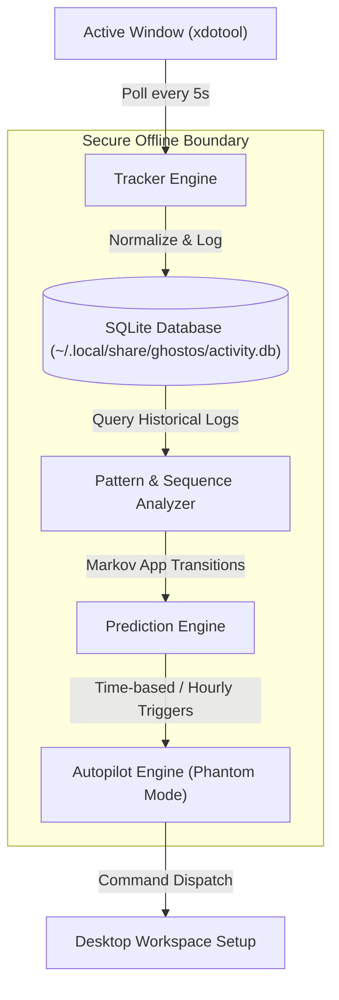

# smarter-startup-apps
- **Visibility**: Public
- **Repository URL**: https://github.com/seeramsujay/smarter-startup-apps
- **Status**: `In Development (No release)`
- **Latest Release Tag**: `None`

## 🚦 Releases & Release Notes
*No releases published yet.*

---

## 📖 README Content

# 👻 GhostOS X: Zero-Dependency Proactive Workflow Intelligence for Linux

> Prepares your coding workspaces and application flows before you even touch your keyboard.

[](https://www.python.org/)
[](https://www.kernel.org/)
[](https://opensource.org/licenses/MIT)

GhostOS X is an ultra-lightweight, local-first Linux background service that learns your desktop behaviors, predicts your next action sequence, and automatically stages your workspace before you start. Unlike bloated, resource-heavy machine learning frameworks, it operates entirely offline using deterministic Markov-like state transitions and a local SQLite database to deliver sub-millisecond, zero-dependency environment preparation.

---

## 🧠 Cognitive Architecture

GhostOS X acts as a continuous loop of window logging, state-sequence learning, and proactive application orchestration:



---

## ⚡ Core Performance Pillars

*   **Proactive Workspace Staging:** Automatically reconstructs and launches complex app chains (e.g., Chrome ➔ VSCode ➔ Terminal) based on historical time-of-day sequence likelihoods.
*   **Privacy-First Offline Tracking:** No cloud connections, no metrics collection, and no heavy telemetry. All data is collected and audited locally.
*   **Zero-Dependency Prediction:** Computes high-accuracy app transition probabilities using a lightning-fast mathematical sequence-matching engine over local SQLite history.
*   **Daemon Auto-Cooldown:** Implements highly robust, configurable systemd daemon integration with automatic cooldown periods to prevent intrusive or duplicate app launches.

---

## ⚙️ System Specifications & Constraints

To maintain absolute local efficiency, GhostOS X is built with minimal computational footprint targets:
*   **Hardware Baseline:** Designed to run flawlessly on dual-core processors (e.g., Intel i5 MacBook Air 2017 dual-core, 8GB RAM). Average memory consumption is under **30MB**.
*   **Linux Interface:** Requires X11 for window focus detection. 
    > [!WARNING]
    > **Wayland Limit:** While application launching and predictions work perfectly on Wayland, live window focus tracking via `xdotool` requires XWayland or an active X11 desktop environment.
*   **No Heavy Frameworks:** Operates entirely without PyTorch, TensorFlow, or Python heavy ML packages to keep the installation size under 1MB.

---

## 🚀 Quick Start (Under 60 Seconds)

### 1. Install Dependencies
Ensure `xdotool` is available on your Linux system:

```bash
# Debian / Ubuntu
sudo apt install xdotool espeak -y

# Fedora
sudo dnf install xdotool espeak -y
```

### 2. Install GhostOS X
Clone the repository and build the package:

```bash
git clone https://github.com/seeramsujay/smarter-startup-apps.git
cd smarter-startup-apps
pip install .
```

### 3. Usage Commands
Operate the interface directly from your shell:

```bash
# Begin background tracking session
ghostos track

# Query daily productivity reports with visual console bars
ghostos report

# Review transition sequence predictions
ghostos sequences

# Test and run workflow autopilot (Phantom Mode)
ghostos autopilot

# Configure settings dynamically
ghostos config set voice true
```

---

## 📊 Sample Terminal Output

### Productivity & Session Audits
```text
╔══════════════════════════════════════╗
║       GHOST OS X — DAILY REPORT      ║
╠══════════════════════════════════════╣
║  Date: 2026-04-15                   ║
╚══════════════════════════════════════╝

=== Overview ===
Total tracked: 6.7h
Total sessions: 12
Focus score: [████████████████████] 100/100

=== App Breakdown ===
  Chrome             3.0h  ▓▓▓▓▓▓▓▓▓░░░░░░░░░░░  45%
  VSCode             2.5h  ▓▓▓▓▓▓▓░░░░░░░░░░░░░  38%
  Terminal          30.0m  ▓░░░░░░░░░░░░░░░░░░░  8%
```

### Phantom Autopilot Sequence
```text
[GhostOS] Hour: 09:00 (State Match Found)
[GhostOS] Reconstructing previous workflow chain...
[GhostOS] Chain Identified: Chrome ➔ Terminal
[GhostOS] Launching Chrome... [OK]
[GhostOS] Launching Terminal... [OK]
```

---

## 🛠️ Diagnostics & Troubleshooting

*   **TTS Voice Support Missing:** If you see `[GhostOS] ℹ No TTS engine found`, install `espeak` via your package manager and activate the setting via `ghostos config set voice true`.
*   **Database Lockouts:** In the rare event of database corruption, GhostOS X automatically backs up your tracking metrics to `~/.local/share/ghostos/activity.db.bak` and re-initializes a fresh SQLite storage space automatically.

---

## 📄 License

Distributed under the **MIT License**. See `LICENSE` for details.
