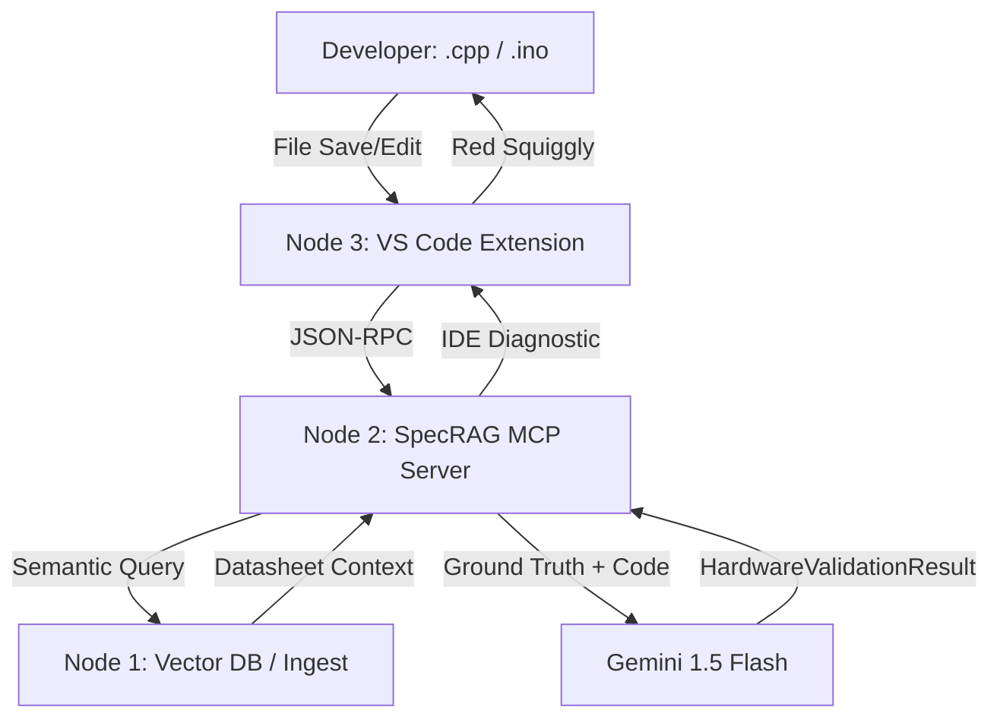

# specRAG
- **Visibility**: Public
- **Repository URL**: https://github.com/seeramsujay/specRAG
- **Status**: `Released (SpecRAG VS Code Extension v0.1.0)`
- **Latest Release Tag**: `SpecRAG VS Code Extension v0.1.0`

## 🚦 Releases & Release Notes
```text
SpecRAG VS Code Extension v0.1.0	Latest	v0.1.0	2026-06-10T03:59:42Z
```

---

## 📖 README Content

# 🦾 SpecRAG: Zero-Hallucination Firmware Auditing
### **RAG-Powered Hardware Validation via Model Context Protocol (MCP)**

[](file:///home/suzaykid/Projects/specRAG/Archives/LICENSE)
[](https://modelcontextprotocol.io)
[](https://openai.com)

> **"Hardware is hard, but it shouldn't be silent."**

**SpecRAG** is a high-precision firmware validation engine that bridges the "semantic gap" between 1,000-page hardware datasheets and your C/C++ firmware. It uses a **Model Context Protocol (MCP)** server to inject real-time register-level intelligence directly into your IDE, catching fatal violations before they ever reach a PCB.


---

## 📑 The Silent Failure Problem
Embedded C/C++ compilers are excellent at catching syntax errors, but they are blind to hardware intent. A developer can write clean, valid C++ that:
- Writes to **Read-Only** memory-mapped registers.
- Uses an incorrect **I2C/SPI slave address**.
- Violates **timing constraints** (e.g., reading a sensor before its 100ms startup delay).
- Configures **clock bitmasks** that unintentionally disable critical peripherals.

These errors lead to weeks of oscilloscope debugging or, worse, charred silicon. SpecRAG moves these "Runtime Disasters" to "Compile-time Squiggles."

## 🚀 Key Innovation: The SpecRAG Stack

### 1. Zero-Hallucination RAG
SpecRAG doesn't rely on the LLM's internal (and often outdated) knowledge of hardware. It uses a custom **RAG Pipeline** (Node 1) to retrieve the exact table or register description from the component's **PDF Datasheet** and feeds it as "Ground Truth" to the auditor.

### 2. Structured Output Guarantee (Pydantic)
Using **Gemini 1.5 Flash's Structured Output API** and **Pydantic** models, SpecRAG mathematically guarantees that the auditor's response is valid JSON. It cannot return "conversational fluff"—only actionable data for the VS Code UI.

### 3. MCP Decoupling
By using the **Model Context Protocol**, the "Brain" (AI) is completely decoupled from the "Body" (IDE). You can run the SpecRAG server on a powerful lab machine while coding on a lightweight laptop.

## 🏗️ System Architecture


## 🛠️ Installation & Setup

### 1. Requirements
- Python 3.10+
- At least one LLM API key:
  - **Gemini API Key** (Set `GEMINI_API_KEY` in `.env`)
  - **Azure OpenAI API Key** (Set `AZURE_OPENAI_API_KEY` and `AZURE_OPENAI_ENDPOINT` in `.env`)
  - **OpenAI API Key** (Set `OPENAI_API_KEY` in `.env`)

### 2. Quick Start
```bash
git clone https://github.com/suzaykid/specRAG.git
cd specRAG
python -m venv venv
source venv/bin/activate  # Or venv\Scripts\activate on Windows
pip install -r requirements.txt
cp .env.example .env      # Or configure the created .env directly
```

### 3. Usage
Run the MCP server locally over stdio:
```bash
# Recommended: Runs via Server.py which automatically loads .env configuration
python Server.py
```

### 4. VS Code Extension Installation (Node 4 Client)
Since this is a desktop IDE extension, the deployment artifact is a compiled `.vsix` file.

**To install the extension:**
1. Download the compiled `specrag-vscode-0.1.0.vsix` file from the **GitHub Releases** assets (or use the locally generated file at `extension/specrag-vscode-0.1.0.vsix`).
2. Open VS Code.
3. Go to the Extensions View (`Ctrl+Shift+X` or `Cmd+Shift+X`).
4. Click the `...` menu button in the top-right corner of the Extensions panel.
5. Select **Install from VSIX...** from the dropdown menu.
6. Select the downloaded `.vsix` file to install it.

**Configuration Settings:**
After installing, adjust the extension settings in VS Code (`specrag.*`):
*   `specrag.pythonPath`: Set to the path of your virtual environment's Python binary (e.g., `/path/to/specRAG/venv/bin/python3`).
*   `specrag.serverPath`: Set to the absolute path of `Server.py` in this repository (e.g., `/path/to/specRAG/Server.py`).
*   `specrag.useMock`: Toggle to `true` to run dry-run mock validation checks offline without querying the live LLM.

## 🗺️ Roadmap Status
- [x] **P1: Foundation**: MCP SDK Server shell & Protocol definition.
- [x] **P2: Deep Build**: LLM integrations (Gemini, Azure OpenAI, OpenAI) & System Prompt engineering.
- [x] **P3: Integration**: Dynamic RAG retriever hook, mock fallback, and exception handling.
- [x] **P4: Polish**: Server wrapper entry point (`Server.py`) & environment variables (`.env`).

## 🤝 Team Integration
For internal contributors, please refer to:
- **[Users.md](Users.md)**: Node-specific handover instructions.
- **[CHANGELOG.md](CHANGELOG.md)**: Detailed technical history and recently fixed path/protocol bugs.
- **[Archives/AGENT.md](Archives/AGENT.md)**: The "Senior Auditor" personality configuration.

---

*This project is licensed under the GPL-3.0 License. Built for the Hackathon by Node 2.*


---

## 🛡️ Licensing & Privacy Protection

Because this repository contains personal code, portfolios, or intellectual property, **strict privacy protections are in place**.

### ⚠️ Prohibitions on AI Training & Scraping
This repository is published for direct human viewing only. Automated data scraping, harvesting, and crawling are strictly prohibited under the author's personal copyright terms.

**By accessing this repository or its contents, you agree to the following terms:**
*   **NO AI/LLM Ingestion:** Any ingestion of code, text, layouts, designs, or assets for training, validation, testing, or tuning of machine learning models, neural networks, or artificial intelligence systems (such as Large Language Models) is strictly prohibited.
*   **NO Automated Data Scraping:** Any automated extraction, parsing, harvesting, or scraping of content by bots, crawlers, scripts, or spiders is prohibited.
*   **Personal Use Only:** Human viewing for personal or educational review is permitted. No duplication, modification, adaptation, or commercial distribution of this work is allowed without express written permission.
